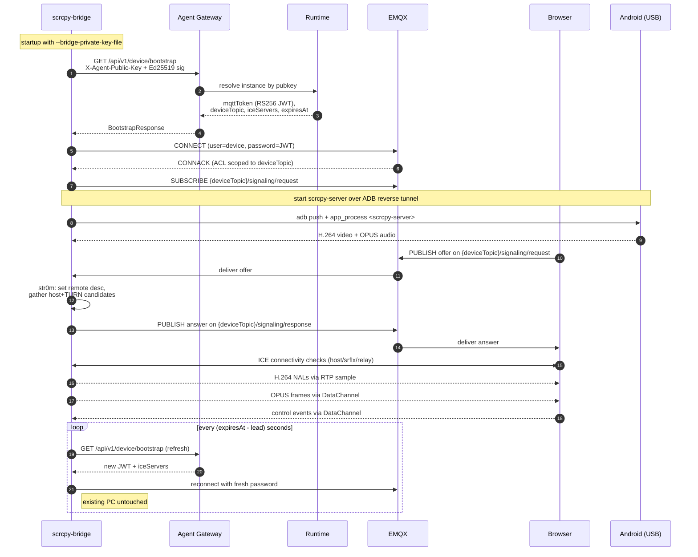

# scrcpy-bridge — Local Debug Runbook (Real USB Android Device)

This is the end-to-end recipe for running `scrcpy-bridge` on your laptop
against a real USB-attached Android phone, talking to **locally running**
BeeOS backend services (Agent Gateway, EMQX, Runtime, TURN). It assumes
the standard `backend/docker-compose.yml` + `goreman` stack is up (see
`.cursor/rules/local-dev-services.mdc` for the baseline).

For the "bootstrap is sole authority" architecture and the production
deployment model, read `README.md` first. This document only covers the
development-loop specifics where bypasses and shortcuts differ from prod.

> **TL;DR — just want to see your phone in the local web UI?** Jump to
> [Shortcut: via `beeos device attach`](#shortcut-via-beeos-device-attach).
> The 11-step manual runbook below exists for when you're debugging the
> Rust / bridge internals and need full control over every env var.

## Shortcut: via `beeos device attach`

Since `@beeos-ai/cli` ≥ 1.1, a single command wires up **device-agent**
(ACP over Bridge WebSocket) *and* **scrcpy-bridge** (WebRTC over EMQX)
against the same identity key and instance binding — no manual key
splitting, no manual `curl` against `/api/v1/instances`.

```bash
# one-time: point the CLI at your local control plane
cat > ~/.beeos/config.toml <<'EOF'
[platform]
api_url = "http://localhost:9080"
agent_gateway_url = "http://localhost:8083"
dashboard_base_url = "http://localhost:3000"
bridge_url = "ws://localhost:18443"

[device]
http_enabled = true
http_port = 9090
EOF

# plug in the phone, then:
beeos device attach --serial R5CT1234         # or --all
#  → installs device-agent (Python)
#  → installs scrcpy-bridge (cargo-dist release)
#  → generates ~/.beeos/identity/device-R5CT1234.key.json
#  → opens browser for bind confirmation (first time only)
#  → spawns device-agent + scrcpy-bridge detached
#  → writes both pids to ~/.beeos/devices.json

# open http://localhost:3000/devices/<instanceId> in the browser
beeos device list                             # see pids, http port, bridge log

beeos device detach --serial R5CT1234         # kills both processes
```

Key design points worth knowing:

- **Key material reuse.** `beeos device attach` generates ONE
  `~/.beeos/identity/device-<serial>.key.json` and points scrcpy-bridge
  at that same file for both `BRIDGE_PRIVATE_KEY_FILE` and
  `BRIDGE_PUBLIC_KEY_FILE`. Rust's `bootstrap::read_private_key_file` /
  `read_public_key_file` dispatch on the `privateKey` / `publicKey`
  JSON fields. You do NOT need the `openssl genpkey` dance from §2.
- **Agent Gateway URL.** Derived from `[platform] agent_gateway_url` in
  `~/.beeos/config.toml` — set it to `http://localhost:8083` for local
  dev. If `api_url` points at `localhost:9080` and no explicit
  `agent_gateway_url` is set, the CLI auto-derives `:8083`.
- **`--no-video`.** Only runs device-agent, skipping scrcpy-bridge.
  Useful when you're iterating on ACP / Python code and don't want the
  WebRTC sidecar in the log stream.
- **Failure handling.** If scrcpy-bridge fails to install / spawn (e.g.
  no cargo-dist archive for your OS yet), attach prints a warning but
  keeps device-agent running — your ACP tools still work, you just
  won't see live video until the bridge is reinstalled.

The rest of this document — the 11-step manual workflow — is the
"debug mode" runbook. Use it when you're developing the bridge itself
or need to inspect a specific env var.

## 0. Prerequisites

| Tool                  | Version             | Notes                                          |
|-----------------------|---------------------|------------------------------------------------|
| Rust                  | stable (see `rust-toolchain.toml`) | `rustup toolchain install stable`             |
| `adb`                 | 34+                 | Android Platform Tools                         |
| `openssl`             | 1.1 or 3.x          | Ed25519 key generation (see DEVICE_KEYS.md)    |
| Android phone         | Android 8+          | Developer Options + USB debugging enabled      |
| `pnpm` + `go`         | Latest              | Only needed for CLI / backend rebuilds         |
| Chrome / Edge         | 118+                | For `device-viewer` (H.264 + OPUS)             |

Backend baseline (`backend/`):

```
docker compose up -d                      # postgres + redis + emqx + minio + coturn
PATH=$PATH:$HOME/go/bin goreman -f Procfile.staging start
```

Verify these five services are listening:

- Agent Gateway `:8083`
- Runtime gRPC  `:50053`
- EMQX MQTT     `:1883` (TCP) and `:8093` (WS)
- coturn        `:3478`
- ClusterService `:50051`

## 1. Plug in the phone and sanity-check ADB

```bash
adb devices
# List of devices attached
# R5CT1234    device
```

Accept the RSA fingerprint prompt on the phone. If the serial says
`unauthorized`, revoke on the phone (Developer Options → Revoke USB
debugging authorizations) and replug.

Record the serial — you will use it everywhere as `$SERIAL`.

```bash
export SERIAL=R5CT1234
```

## 2. Generate an Ed25519 identity for the phone

scrcpy-bridge signs every bootstrap request with Ed25519. Two key-file
layouts are accepted — pick whichever matches your workflow:

### Option A — `.key.json` (recommended; interop with `beeos` CLI)

If you're also going to run `device-agent` or `beeos device attach`
against the same phone, use the JSON layout so a single file serves
both binaries:

```bash
mkdir -p ~/.beeos/identity
beeos device attach --serial "$SERIAL"  # creates device-$SERIAL.key.json
beeos device detach --serial "$SERIAL"  # stop the processes; keep the key
export KEY=~/.beeos/identity/device-$SERIAL.key.json
```

Point **both** env vars at the same file later in §6:

```bash
BRIDGE_PRIVATE_KEY_FILE="$KEY" BRIDGE_PUBLIC_KEY_FILE="$KEY" ./target/release/scrcpy-bridge ...
```

`bootstrap::read_private_key_file` extracts `privateKey` and
`read_public_key_file` extracts `publicKey` from the same JSON — no
split files needed.

### Option B — raw base64 seed (mirrors cluster-proxy secret layout)

Useful when you're explicitly testing the k8s secret path or want two
physically separate files. See **`deploy/edge/DEVICE_KEYS.md` §1** for
the full sequence. Short version:

```bash
mkdir -p ~/.beeos/device-keys
cd ~/.beeos/device-keys

openssl genpkey -algorithm ED25519 -out "$SERIAL.pem"
openssl pkey -in "$SERIAL.pem" -outform DER 2>/dev/null | tail -c 32 | base64 > "$SERIAL.key"
openssl pkey -in "$SERIAL.pem" -pubout -outform DER 2>/dev/null | tail -c 32 | base64 > "$SERIAL.pub"
chmod 600 "$SERIAL.key" && chmod 644 "$SERIAL.pub"
rm "$SERIAL.pem"
```

Sanity check — both files must be exactly 32 bytes after base64 decode:

```bash
test "$(base64 -d < "$SERIAL.key" | wc -c)" = "32" && echo seed-ok
test "$(base64 -d < "$SERIAL.pub" | wc -c)" = "32" && echo pub-ok
```

If your system OpenSSL 3.x refuses `tail -c 32` (strict ASN.1 mode),
use the alternative `openssl pkey -text -noout` path documented at the
bottom of `deploy/edge/DEVICE_KEYS.md`.

## 3. Create an `instance` in the local control plane

scrcpy-bridge bootstrap resolves `instance_id` by looking up
`X-Agent-Public-Key`. Without a matching instance record, Agent Gateway
returns 401 immediately.

```bash
JWT=$(cat ~/.beeos/dev.jwt)   # any JWT from logging into local web
PUB=$(cat ~/.beeos/device-keys/$SERIAL.pub)

curl -sS -X POST http://localhost:9080/api/v1/instances \
  -H "Authorization: Bearer $JWT" \
  -H "Content-Type: application/json" \
  -d "$(jq -nc --arg name "dev-$SERIAL" --arg pub "$PUB" --arg serial "$SERIAL" '
      { name: $name,
        providerId: "device",
        providerConfig: { agentPublicKey: $pub, deviceType: "android", serial: $serial }
      }')" | tee /tmp/instance.json

INSTANCE_ID=$(jq -r .instanceId /tmp/instance.json)
echo "DEVICE_ID will be device-$INSTANCE_ID"
```

> **Important.** `DEVICE_ID` passed to scrcpy-bridge is the ADB serial
> (`$SERIAL`) — used only for client-id suffix and log tagging. The MQTT
> topic prefix is `devices/device-<instanceUUID>` and it comes back from
> `/bootstrap`; you never hand-craft it.

## 4. Fetch / check `scrcpy-server.jar`

`build.rs` downloads the matching `scrcpy-server` at build time and
embeds it via `include_bytes!`. It also sha256-verifies the result, and
**skips the download if `assets/scrcpy-server.jar` already has the right
hash** — so for local dev on a flaky / offline network, pre-seed the jar
once and subsequent builds will skip GitHub entirely:

```bash
# pre-cache to agents/scrcpy-bridge/assets/scrcpy-server.jar
./scripts/fetch-scrcpy-server.sh

# subsequent builds re-use the cached jar automatically
cargo build --release

# point at a custom location (e.g. corp mirror):
SCRCPY_SERVER_JAR=/opt/scrcpy/scrcpy-server-v3.1.jar cargo build --release
```

## 5. Build `scrcpy-bridge`

```bash
cd agents/scrcpy-bridge
cargo build --release
# binary at ./target/release/scrcpy-bridge
```

## 6. Run `scrcpy-bridge` against local Agent Gateway

```bash
cd agents/scrcpy-bridge
RUST_LOG=info,scrcpy_bridge=debug,rumqttc=warn \
DEVICE_ID="$SERIAL" \
ADB_SERIAL="$SERIAL" \
AGENT_GATEWAY_URL="http://localhost:8083" \
BRIDGE_PRIVATE_KEY_FILE="$HOME/.beeos/device-keys/$SERIAL.key" \
BRIDGE_PUBLIC_KEY_FILE="$HOME/.beeos/device-keys/$SERIAL.pub" \
JWT_REFRESH_LEAD_SECS=60 \
JWT_REFRESH_MIN_INTERVAL_SECS=30 \
PUBLIC_IPS="$(ipconfig getifaddr en0)" \
ICE_GATHER_WAIT_MS=250 \
./target/release/scrcpy-bridge
```

Expected startup log sequence:

```
bootstrap credentials fetched from Agent Gateway  device_topic=devices/device-...  expires_at=...
mqtt signaling connected                          url=ws://... topic=devices/device-.../signaling/#
scrcpy-server pushed and started                  serial=R5CT1234
metrics server listening                          addr=0.0.0.0:9091
bootstrap refresh scheduled                       wait_secs=~540
```

If you see `bootstrap response missing deviceTopic` — your local
Runtime doesn't know the new stream-params fields yet. Rebuild & restart
`beeos-runtime` against the current schema.

## 7. Open the device-viewer

```bash
cd web/apps/web && pnpm dev --port 3000   # or `cd web/apps/device-viewer && pnpm dev`
```

Navigate to `http://localhost:3000/devices/<instanceId>` (or the standalone
device-viewer with the same ID). Within ~1 s you should see the phone
screen, hear the audio (unless `DISABLE_AUDIO=1`), and be able to
tap/type from the browser.

## 8. Smoke-test JWT refresh (two paths)

**Slow path** — wait ~9 minutes and check the counter:

```bash
curl -s http://localhost:9091/metrics | grep -E "jwt_refresh_total|mqtt_reconnects_total"
# scrcpy_bridge_jwt_refresh_total{result="success"} 1
# scrcpy_bridge_mqtt_reconnects_total 1
```

**Fast path** — set a tiny lead so the refresher fires within the first
minute:

```
JWT_REFRESH_LEAD_SECS=570 JWT_REFRESH_MIN_INTERVAL_SECS=5 ./target/release/scrcpy-bridge ...
```

Watch for `MQTT credentials rotated` in logs, and confirm the video/audio
never pauses (active PCs ride on their own UDP sockets — rotation rebuilds
the MQTT session only).

## 9. Smoke-test MQTT topic ACL

If you suspect the ACL isn't aligned with the JWT claims, dump the topic
used for signaling and try publishing with a wrong prefix:

```bash
# Correct prefix (tail the response stream)
mosquitto_sub -h localhost -p 1883 -u device -P "$JWT_FROM_BOOTSTRAP" \
    -t "devices/device-$INSTANCE_ID/signaling/response"

# Wrong prefix — EMQX should send CONNACK with "not authorized" or
# suback with 0x87 (unauthorized) for the subscribe.
mosquitto_sub -h localhost -p 1883 -u device -P "$JWT_FROM_BOOTSTRAP" \
    -t "devices/device-WRONG/signaling/response"
```

## 10. Smoke-test ICE fallback

```bash
# With no TURN allowed (simulate strict NAT)
ICE_GATHER_WAIT_MS=1500 ICE_URLS="" \
./target/release/scrcpy-bridge ...
```

The browser side should negotiate a `relay` candidate pair because the
bootstrap response always ships your local coturn as a TURN server. If
the PC flaps to `failed`, check:

- `TURN_URLS` set on Runtime includes `turn:localhost:3478`
- `TURN_USERNAME` / `TURN_CREDENTIAL` on Runtime match coturn's static
  creds in `backend/docker-compose.yml`
- The Pod's public IP is in `PUBLIC_IPS` — str0m only auto-emits a
  host candidate for the OS-bound address.

## 11. Tear down

```bash
# Ctrl-C scrcpy-bridge
curl -s -X DELETE \
    -H "Authorization: Bearer $JWT" \
    http://localhost:9080/api/v1/instances/$INSTANCE_ID
rm ~/.beeos/device-keys/$SERIAL.key ~/.beeos/device-keys/$SERIAL.pub
```

## Sequence diagram (bootstrap → MQTT → WebRTC)



## Troubleshooting (10 common issues)

1. **`bootstrap response missing deviceTopic`**
   Local Runtime is running old code. Rebuild `beeos-runtime` after
   pulling; the `deviceTopic` field shipped with the bootstrap
   refactor.

2. **`bootstrap fetch from Agent Gateway: 401`**
   Public key not registered (step 3) or `.pub` doesn't match the `.key`.
   Rerun step 2's 32-byte check on both files.

3. **EMQX `SUBACK` reason 0x87 or disconnect within seconds of CONNECT**
   Your JWT's `acl` claim scopes to a different prefix than you're
   subscribing on. This is always caused by constructing the topic
   from `DEVICE_ID` instead of the bootstrap's `deviceTopic`. Grep for
   `topic_prefix` in your fork — `MqttSignalingConfig.topic_prefix`
   must be populated from `BootstrapResponse.device_topic`.

4. **`scrcpy-server not found` or `crash at startup`**
   Set `SCRCPY_SKIP_DOWNLOAD=1` at build time but forgot to drop the
   real jar into `assets/`. Run
   `./scripts/fetch-scrcpy-server.sh` or do a clean `cargo build`
   without the skip flag.

5. **PC stuck in `checking` and never turns `connected`**
   NAT is eating host candidates. Either:
   - Add your machine's public IP via `PUBLIC_IPS=…`.
   - Ensure the TURN entry in the bootstrap response works:
     `curl -v turn://localhost:3478 -u beeos:beeos-turn-secret`.

6. **Video plays but audio is silent**
   Chrome autoplay policy — click the page once; OPUS frames are sent
   over DataChannel and muted unless the browser has received a user
   gesture.

7. **`MQTT credentials rotated` never logs after 9 min**
   Clock skew. Set NTP; the JWT `exp` is absolute UNIX seconds and
   `compute_sleep` floors negative values to `min_interval`.

8. **`adb server not running` or random disconnects**
   Phone went to sleep. Developer Options → "Stay awake while charging"
   and bump USB config to `MTP` or `PTP` to keep the interface alive.

9. **Chrome says `NotReadableError` on the video tag**
   Hardware H.264 decoder claimed by another tab. Close the FaceTime /
   Meet tab, or start Chrome with
   `--disable-features=UseMultiPlaneFormatForHardwareVideo`.

10. **`TURN 401` in logs during ICE gather**
    The bootstrap response TURN credential doesn't match coturn's
    static user. Check `TURN_USERNAME` / `TURN_CREDENTIAL` on Runtime
    matches `backend/docker-compose.yml`. For dev, override via
    `--ice-urls`, `--turn-username`, `--turn-credential` — these are
    appended *in addition* to bootstrap (bootstrap entries still win
    when both are present — see `merge_ice_servers`).

## Never do these in dev

- **Never pass `MQTT_URL` / `MQTT_TOKEN` / `MQTT_USERNAME`.** They are
  not recognised; a static token would silently die after 10 minutes.
- **Never derive MQTT topics from `DEVICE_ID`.** Use the bootstrap's
  `deviceTopic` — the JWT ACL is scoped exactly to that string.
- **Never hand-edit `scrcpy-server.jar`.** The Rust binary ships a
  pinned sha256; a mismatched jar makes the server exit silently.
- **Never set `ICE_URLS` / `TURN_USERNAME` / `TURN_CREDENTIAL` in a
  production deployment.** Those are dev-only overrides appended after
  bootstrap; they never rotate.
